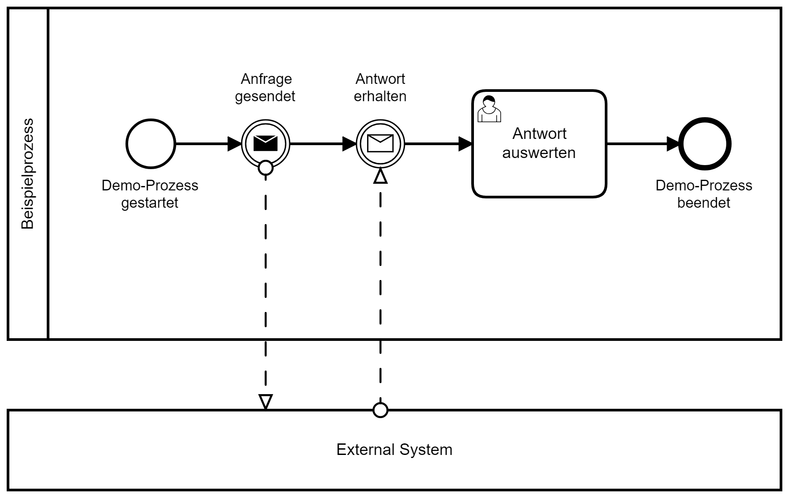

# Async-Rest-Messaging-Beispiel

> Autoren der Dokumentation: Björn Scheppler

> Dokumentation letztmals aktualisiert: 5.10.2019

Dieses Projekt veranschaulicht, wie ein Prozess in Camunda asynchron per REST einem Umsystem eine Nachricht übermittelt und auf eine Antwort wartet. Die Antwort wird als Callback ebenfalls per REST zurückgegeben und mittels MessageCorrelation mit der ursprünglichen Prozessinstanz verknüpft.

Das entsprechende BPMN-Modell sieht wie folgt aus:

## Komponenten
Es sind zwei Maven-Projekte mit Spring Boot-Applikationen in dieser Github-Repository:

1. **Camunda-Applikation** (async-rest-messaging-template-camunda):
   1. Klassische Camunda-Prozessapplikation erstellt mit https://github.com/zhaw-gpi/camunda-spring-boot-template
   2. Enthält das oben abgebildete Prozessmodell,
   3. Ein JavaDelegate **SendRequestDelegate**, welcher die zweite Applikation per REST aufruft und ihr eine JSON-Nachricht übergibt basierend 
   4. auf der Klasse **Demo**. Diese umfasst folgende Eigenschaften:
      1. URL: die Callback-URL, damit das aufgerufene System weiss, an wen es die Antwort senden muss.
      2. Body: Statischer Inhalt "Ich bin der super-spannende Inhalt dieser Nachricht."
      3. BusinessKey: Der BusinessKey der Prozessinstanz, was später für die MessageCorrelation wichtig ist.
   5. Es wird dabei lediglich geprüft, ob dieser Aufruf technisch funktioniert hat (Antwort 202).
   6. Um den Callback-Aufruf per REST verarbeiten zu können, gibt es den **CamundaRestController**, welcher ein PostMapping auf die Methode addDumo enthält. Diese erwartet eine JSON-Nachricht basierend auf der
   7. Klasse **Dumo**. Diese umfasst folgende Eigenschaften:
      1. BusinessKey: Derselbe BusinessKey, welcher schon beim Aufruf an das Umsystem übergeben wurde für die MessageCorrelation
      2. Time: Just for fun, übermittelt das aufrufende System dessen aktuelles Datum und Uhrzeit als String.
   8. Basierend auf dem BusinessKey und dem Namen der Message im BPMN-Modell ("Antwort") versucht der CamundaRestController diejenige Prozessinstanz zu finden, welche a) diesen BusinessKey aufweist und b) im Status ist, dass sie auf eine Message "Antwort" wartet.
   9. Gelingt dies, wird automatisch die Ausführung der Prozessinstanz fortgesetzt.
2.  **Umsystem** (async-rest-messaging-external-system):
    1.  Klassische Spring-Boot-Web-Applikation erstellt auf Basis von https://github.com/zhaw-gpi/vekacenter
    2.  Enthält die schon aus der Camunda-Applikation bekannten Klassen **Demo** und **Dumo**
    3.  Enthält die Klasse **ExternalSystemRestController**, welche dem oben genannten CamundaRestController entspricht, also ein PostMapping auf eine Methode enthält, die nur zwei Dinge durchführt:
        1.  Aufrufen einer Methode **waitAndSendResponse** in der Klasse **AsyncMethods**
        2.  Synchron mit Status 202 antworten.
    4.  Die Methode **waitAndSendResponse** 
        1.  ist mit @Async annotiert, d.h. sie unterbricht nicht den aufrufenden Thread, sondern wird in einem eigenen Thread ausgeführt. 
        2.  Dabei wird zunächst einmal 5 Sekunden gewartet. Damit wird simuliert, dass hier z.B. ein Mensch in einem System etwas machen muss, bevor der Camunda-Applikation eine Antwort gesendet werden kann.
        3.  Dann wird die aktuelle Uhrzeit als Antwort aufbereitet.
        4.  Per REST wird nun die Antwort (aktuelle Uhrzeit und der bekannte BusinessKey) an die Camunda-Applikation gesendet, konkret an die in der Eigenschaft URL aus Demo bekannte URL.

## Ausführen der Applikationen
### Deployment
1. **Erstmalig** oder bei Problemen ein `mvn clean install` für beide Maven-Projekte durchführen
2. Bei Änderungen am POM-File oder bei **(Neu)kompilierungsbedarf** genügt ein `mvn install`
3. Für den **Start** ist ein `java -jar .\target\NAME DES JAR-FILES.jar` beider Applikationen erforderlich.
4. Das **Beenden** geschieht mit **CTRL+C**

## Nutzung der Applikation
1. localhost:8092
2. Anmelden mit a, a
3. Tasklist
4. Start Process -> "Beispielprozess"
5. Irgendeinen Business Key eingeben und auf Start klicken.
6. Fünf Sekunden warten
7. Folgendes sollte nun passiert sein:
   1. In der Konsole der external-system-Applikation sollte eine neue Zeile hinzugefügt sein mit "Key und Nachricht: ..."
   2. In der Tasklist sollte eine neue Aufgabe "Antwort auswerten" erscheinen
8. Aufgabe aufnehmen (Claim)
9. Zeitstempel "anschauen"
10. Complete drücken
11. Zur "Kontrolle" im Cockpit schauen, ob die Prozessinstanz durch ist.